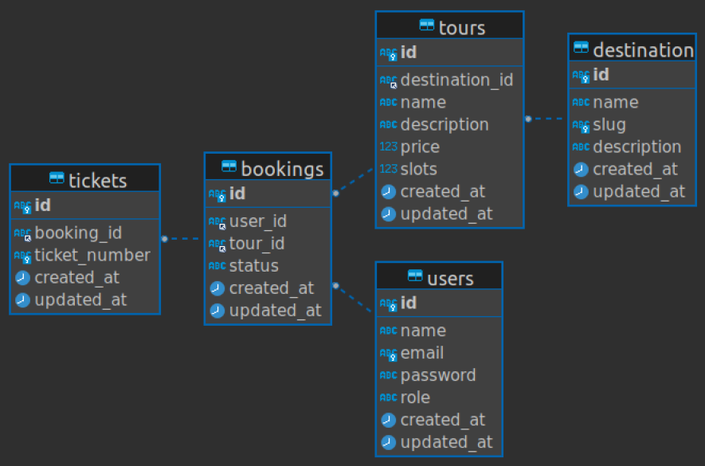

# Tours Booking App 🧳

The coding challenge requires the development of a Laravel backend and a Vue.js frontend for a tour booking system. The task involves creating a RESTful API with CRUD operations, consuming those APIs on the frontend, and ensuring proper state management and authentication.

## Functionality of the System

### User Requirements:

As a **user**, you should be able to:

1. View Available Tours: See a list of tours with destinations, pricing, and descriptions.
2. Book a Tour: Select a tour and book it.
3. Generate a Ticket: After booking, generate and view the ticket.

### Admin Requirements:

As an **admin**, you should be able to:

1. Create Tours: Add new tours with available slots, pricing, descriptions, and destinations.
2. View All Bookings: Access a list of all bookings made by users.
3. View All Tickets: Access all tickets generated from bookings.

### Database Schema:

