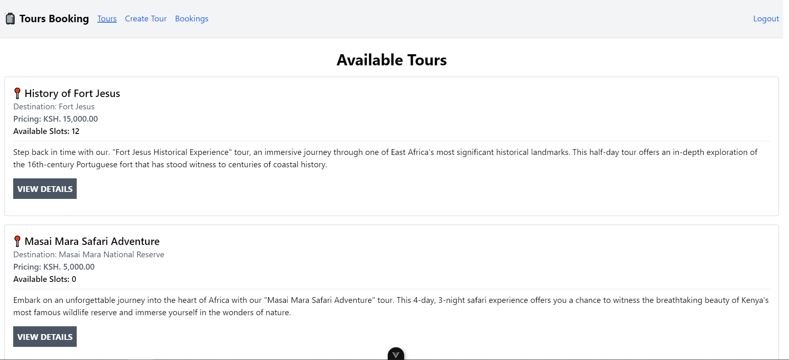

# Tours Booking App 🧳

The coding challenge requires the development of a Laravel backend and a Vue.js frontend for a tour booking system. The task involves creating a RESTful API with CRUD operations, consuming those APIs on the frontend, and ensuring proper state management and authentication.



## Functionality of the System

### User Requirements:

As a **user**, you should be able to:

1. View Available Tours: See a list of tours with destinations, pricing, and descriptions.
2. Book a Tour: Select a tour and book it.
3. Generate a Ticket: After booking, generate and view the ticket.

### Admin Requirements:

As an **admin**, you should be able to:

1. Create Tours: Add new tours with available slots, pricing, descriptions, and destinations.
2. View All Bookings: Access a list of all bookings made by users.
3. View All Tickets: Access all tickets generated from bookings.

### Database Schema:


## Getting Started & Run Locally 

Clone the project

```bash
  git clone https://github.com/vamuigua/tours_booking_app.git
```

Go to the project directory

```bash
  cd tours_booking_app
```

## Setting app the different apps
From here you will see two folders: `backend` and `frontend` .The `backend` is the laravel app that servers the APIs to the`frontend` which is a Vue JS application.

We shall first install and configure the [backend](https://github.com/vamuigua/tours_booking_app?tab=readme-ov-file#1-backend-configuration-laravel-app) then afterwards the [frontend](https://github.com/vamuigua/tours_booking_app?tab=readme-ov-file#2-frontend-configuration-vue-js-app):

### 1. Backend Configuration (Laravel App)
Go to the `backend` directory

```bash
  cd backend
```

Install dependencies

```bash
  composer install
```

Change directory permissison

```bash
  chmod -R 777 storage bootstrap/cache
```

Create an `.env` file

```bash
  touch .env
  cp .env.example .env
```

Update the following environment variables in the `.env` file:

```bash
APP_URL=http://localhost:8000
FRONTEND_URL=http://localhost:5173
SESSION_DOMAIN=localhost
SANCTUM_STATEFUL_DOMAINS=localhost:5173
```

Generate an Application Key

```bash
  php artisan key:generate
```

Migrate the Database

*PS: Ensure you have created a database e.g `car_packing_app` before running the migrate command*

```bash
  php artisan migrate
```

Start the app by running the server

```bash
  php artisan serve
```

The `backend` app will be served on the URL http://localhost:8000/

Now we can move to configuring the `frontend`

### 2. Frontend Configuration (Vue JS App)
Go to the `frontend` directory

```bash
  cd frontend
```

Install dependencies

```bash
  npm install
```

Create an `.env` file

```bash
  touch .env
```

Add the following environment variable in the `.env` file:

```
VITE_BASE_URL=http://localhost:5173/
VITE_TOURS_BOOKING_BACKEND_API=http://localhost:8000
```

*http://localhost:8000 is the URL serving the laravel application.*

Start the app server

```bash
  npm run dev
```

The `frontend` app will be served on the URL http://localhost:5173/

✅ **Start using Tours Booking app:** Once the app is running, you can start by creating an account by visiting the [registration page](http://localhost:5173/register) and explore the app's features.

## 📖 API Reference

Some of the APIs you can find include:

#### Login as a User

```http
  POST api/v1/login
```

| Parameter | Type     | Description                       |
| :-------- | :------- | :-------------------------------- |
| `email`      | `email` | **Required**. |
| `password`      | `string` | **Required**. |
| `remember`      | `bool` | Determines whether the Token will expire at a defined time or not. |

#### Get all Tours

```http
  GET api/v1/tours
```

| Authorization | Type     | Description                       |
| :-------- | :------- | :-------------------------------- |
| `Bearer Token`      | `string` | **Required**. |
